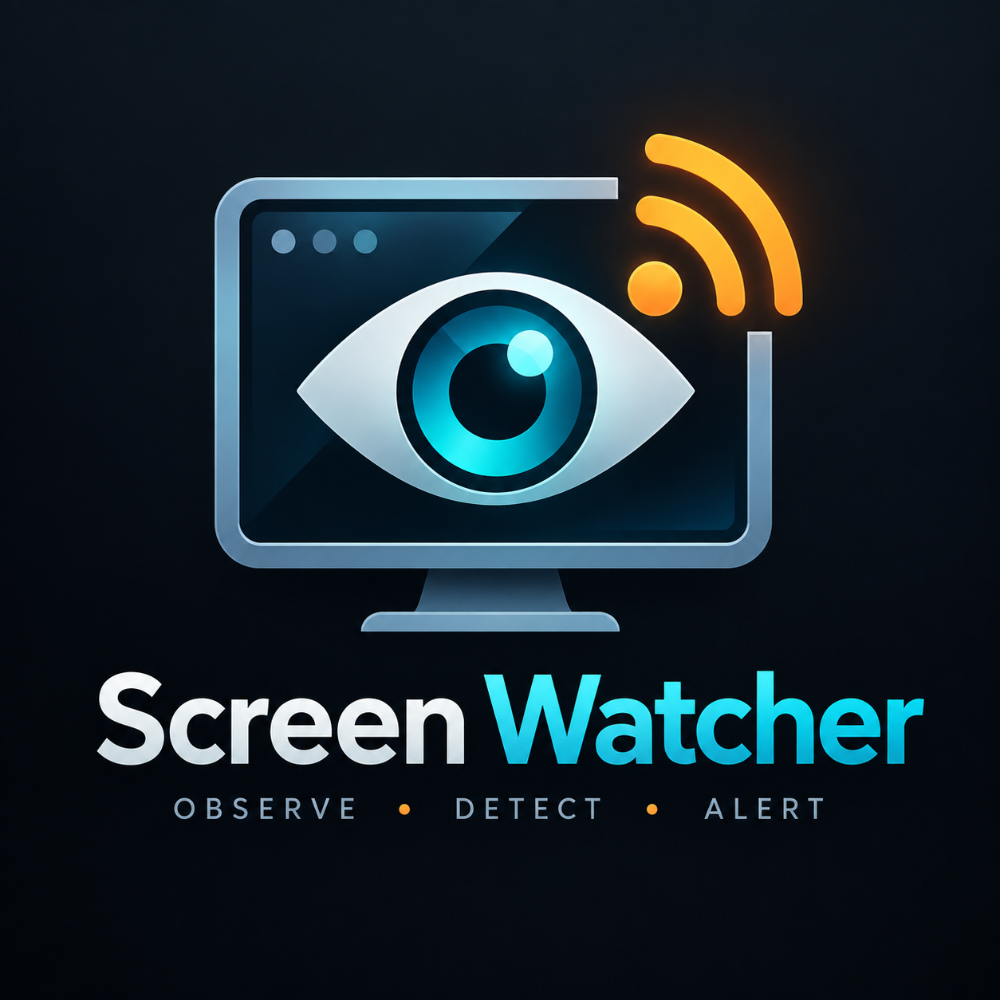

# Screen Watcher

<p align="center">
  
</p>

Screen Watcher is a read-only RuneScape companion for Linux that watches
configured regions of the game client and notifies you when something needs
attention. It can combine OCR, visual change detection, inventory state,
activity timing, and profile-specific rules without clicking, typing, moving
the mouse, or otherwise sending input to the game.

> **Read-only by design.** Screen Watcher observes pixels and produces local
> notifications. It does not automate gameplay or generate game input.

The project is currently an early, functional foundation for a broader
RuneScape observability application. Fishing and thieving/pickpocketing
profiles are included today; most other skills, quests, bosses, and minigames
still need researched profiles, calibration, and fixtures.

For the longer-term architecture and roadmap, see
[docs/application-outline.md](docs/application-outline.md).

## Current status

- **Platform:** Linux desktop
- **Display path:** X11/XWayland
- **Game window detection:** configurable through `window.wm_class`
- **Included profiles:** fishing and thieving/pickpocketing
- **Profile families supported by validation:** `skill`, `quest`, and `boss`
- **Outputs:** desktop notifications, sounds, terminal output, and local JSONL history
- **Automation boundary:** observation only; no synthetic input
- **CI:** pytest and Flake8 on pushes and pull requests

The current implementation is still centered on a single `watcher.py` module.
The planned modular architecture is documented separately and should not be
confused with functionality that has already landed.

## Features

Screen Watcher currently provides:

- anchored regions that follow a resized game window;
- OCR of chat and other text regions;
- frame-to-frame visual change and inactivity detection;
- inventory occupancy and fill-rate monitoring;
- item detection from visual signatures;
- activity-stop detection from missing recurring messages;
- supply-state tracking across repeated bank trips;
- configurable cooldowns, suppression rules, urgency, and sounds;
- per-rule alert history and inventory-cycle statistics;
- calibration, screenshots, probing, and inventory diagnostics;
- explicit profile selection for different activities;
- singleton protection so two watchers cannot double every alert.

Detailed detector behaviour, measurements, and tuning notes live in
[docs/detector-notes.md](docs/detector-notes.md).

## Quick start

### 1. Install dependencies

Screen Watcher currently expects:

- Python 3.10+ (the current CI workflow tests Python 3.12)
- `numpy`
- Pillow
- `xdotool`
- `python-xcffib` — native XCB capture, measured 42x faster than ImageMagick
- ImageMagick (`import`) — automatic fallback when xcffib is unavailable
- Tesseract OCR with English language data
- `notify-send`
- `paplay` for per-rule sounds

On CachyOS/Arch Linux:

```bash
sudo pacman -S --needed \
  python python-numpy python-pillow python-xcffib \
  xdotool imagemagick \
  tesseract tesseract-data-eng \
  libnotify libpulse
```

On Debian/Ubuntu:

```bash
sudo apt install xdotool imagemagick tesseract-ocr libnotify-bin pulseaudio-utils python3-pil python3-numpy python3-xcffib
```

For development and tests:

```bash
python3 -m venv .venv
.venv/bin/python -m pip install -r requirements-dev.txt
```

### 2. Enter the repository

```bash
cd screen-watcher
```

### 3. Choose a profile

The repository currently includes:

```text
profiles/fishing.json
profiles/thieving.json
```

Use `--config` before the subcommand:

```bash
python3 watcher.py --config profiles/fishing.json regions
python3 watcher.py --config profiles/fishing.json watch
```

or:

```bash
python3 watcher.py --config profiles/thieving.json regions
python3 watcher.py --config profiles/thieving.json watch
```

The root `config.json` and `config.fishing.json` files remain compatibility
copies for older workflows, but explicit profile paths are clearer and are
recommended.

### 4. Verify regions before watching

```bash
python3 watcher.py --config profiles/fishing.json regions
python3 watcher.py --config profiles/fishing.json shot chat_tail
```

If the regions do not match your interface layout, calibrate them before
depending on alerts:

```bash
python3 watcher.py --config profiles/fishing.json calibrate
```

### 5. Start the watcher

```bash
python3 watcher.py --config profiles/fishing.json watch
```

Stop it with Ctrl-C.

To keep it running after a terminal closes:

```bash
nohup python3 watcher.py --config profiles/fishing.json watch \
  >> state/watch.log 2>&1 &
```

## Commands

| command | purpose |
|---|---|
| `regions` | show configured regions resolved against the current window |
| `calibrate` | save a scaled full-window image for coordinate calibration |
| `shot [region]` | capture one configured region |
| `probe` | measure frame-to-frame differences for threshold tuning |
| `inv` | show a live inventory slot-change feed |
| `stats` | analyse logged inventory fill/bank cycles |
| `watch` | run the polling and notification loop |
| `alerts` | show per-rule alert counts and rates |
| `backends` | list capture backends and whether they work on this host |
| `status` | report whether a watcher process is running |
| `pause` | pause the running watcher |
| `resume` | resume the paused watcher |

Use:

```bash
python3 watcher.py --help
python3 watcher.py <command> --help
```

for command-specific options.

Only one watcher may run at a time. A second instance refuses to start.
`state/watcher.pid` is used as the singleton marker, and stale PID files are
reclaimed after the recorded process is verified.

## Profiles

Each activity should have an explicit profile rather than combining unrelated
rules into one file.

Examples:

```text
profiles/fishing.json
profiles/thieving.json
profiles/quest-dragon-slayer.json
profiles/boss-vindicta.json
```

Only the first two are currently included.

Top-level profile settings:

| setting | purpose |
|---|---|
| `window.wm_class` | X11/XWayland class used to locate the game window |
| `skill` | human-readable activity/skill identity |
| `profile_type` | `skill`, `quest`, or `boss` |
| `interval` | delay configured between watch-loop iterations |
| `regions` | anchored capture rectangles and optional grids |
| `rules` | detectors, thresholds, cooldowns, configurable notification copy, and notification options |

Profiles are validated before the watcher searches for the game window.
Validation covers required sections, anchors, grid bounds, rule kinds, region
references, numeric values, and regular-expression syntax.

### Switching profiles

Profile changes are explicit. Stop the current watcher and start another one
with the new profile:

```bash
python3 watcher.py status
python3 watcher.py --config profiles/fishing.json watch
# Ctrl-C
python3 watcher.py --config profiles/thieving.json watch
```

Do not edit a profile underneath a running watcher and assume it will be
reloaded. Configuration is read at startup.

The watcher prints the selected profile at startup, and alert-log records
include its skill identity.

Each rule's `message` is the notification title. An optional `alert_body`
sets the notification body and may use detector context such as `{line}`,
`{item}`, `{free}`, or `{total}`; without it, the detector's normal body is
used. Rules with a distinct exhausted state, such as carried consumables, may
also set `out_alert_body` so an "out" warning does not reuse the low-stock
copy. If a configured template contains a missing or malformed placeholder,
Screen Watcher logs a warning and falls back to the detector-generated body
instead of suppressing the alert. OCR alerts retain the matched line separately
as `source_text` in `state/alerts.jsonl`, so dry or imaginative notification
copy does not discard the evidence that caused the alert. Non-OCR alerts omit
`source_text` unless a detector has a concrete source line.

## How regions work

Regions are anchored to the game window instead of relying entirely on absolute
desktop coordinates.

Example:

```json
{
  "anchor": "bottom-left",
  "dx": 5,
  "dy": -57,
  "w": 500,
  "h": 375
}
```

Supported anchors are:

```text
top-left
top-right
bottom-left
bottom-right
top-center
bottom-center
center
```

For right/bottom anchors, negative `dx` or `dy` values measure inward from
that edge. When the detected game window changes size, the watcher resolves the
regions again.

Inventory-like regions can also declare a grid:

```json
{
  "grid": {
    "x0": 17,
    "y0": 86,
    "cell_w": 61,
    "cell_h": 55,
    "cols": 5,
    "rows": 6
  }
}
```

Grid coordinates are relative to the region's top-left corner.

## Rule types

| kind | fires when | typical use |
|---|---|---|
| `inventory` | inventory approaches full or remains full | banking / overflow |
| `activity` | a recurring OCR event stops arriving | stopped skilling activity |
| `item_count` | a visually identified carried item falls below a threshold | consumables or tools |
| `supply` | repeated bank/preset evidence indicates low or exhausted stock | long-run supplies |
| `idle` | a region remains visually unchanged | stalled XP/activity |
| `change` | a region changes beyond a configured threshold | appearance/state changes |
| `ocr` | a newly observed line matches a regular expression | level-ups, messages, events |
| `loot` | a named item appears in chat, ignoring routine currency lines | rare drops worth seeing |
| `counter` | a repeating numeric chat line accumulates past a milestone | coin/XP totals over hours |
| `stack` | a backpack slot's stack signature changes and remains changed | detecting newly gained inventory items |
| `timer` | an OCR'd in-game timer crosses a configured milestone | session-duration reminders |
| `presence` | a visual indicator remains absent, with optional corroboration | stopped-activity detection |

`cooldown` throttles repeat alerts per rule.

For detector-specific algorithms, measurements, false-positive handling, and
the fishing experiments that informed the current defaults, see
[docs/detector-notes.md](docs/detector-notes.md).

## Diagnosing excessive alerts

Every delivered notification is recorded in `state/alerts.jsonl`. Use:

```bash
python3 watcher.py alerts
```

Example output:

```text
15 alerts over 4.57h  (3.3/hour)

rule                  count  per hour  median gap
pack_nearly_full         15       3.3         82s
```

If a rule's median gap closely matches the activity's natural cycle, it may be
firing once per cycle rather than only when intervention is useful.

For inventory tuning:

```bash
python3 watcher.py stats
```

For visual thresholds:

```bash
python3 watcher.py --config profiles/fishing.json probe
```

## X11 / XWayland access

The watcher must be able to access the active X/XWayland session. This matters
especially when it is launched from a service, automation shell, or other
environment that does not inherit the desktop session.

The program attempts to recover `DISPLAY` and `XAUTHORITY` from a live
desktop process such as Plasma/KWin or GNOME Shell when needed.

To inspect the values manually on Plasma:

```bash
tr '\0' '\n' < /proc/$(pgrep -u "$USER" plasmashell | head -1)/environ \
  | grep -E '^(DISPLAY|XAUTHORITY)='
```

If window discovery fails, first verify:

```bash
xdotool search --onlyvisible --class <wm_class-from-profile>
```

The exact `wm_class` is profile-specific and can be changed.

## Runtime files

Persistent runtime state is stored under `state/` and ignored by Git except
for the placeholder file.

| path | contents |
|---|---|
| `state/watch.log` | stdout/stderr when started with the background example |
| `state/alerts.jsonl` | structured notification history |
| `state/occupancy.jsonl` | inventory transitions used by `stats` |
| `state/counters.jsonl` | running `counter` totals, restored at startup |
| `state/watcher.pid` | singleton process marker |
| `calibrate.png` | default full-window calibration image written in the repository root |
| `shot_<region>.png` | default output from `shot` when `--out` is not supplied |
| system temporary directory | short-lived OCR/capture scratch files, removed automatically |

`calibrate.png` is ignored by Git. Named `shot_<region>.png` files are useful
for local diagnostics but should be treated as potentially account-specific
captures.

Do not commit runtime screenshots, logs, or account-specific captures unless
they have been deliberately sanitized and added as test fixtures.

## Development

Run tests:

```bash
.venv/bin/python -m pytest -q
```

Run the lint policy used by CI:

```bash
.venv/bin/python -m flake8 watcher.py tests \
  --ignore=E226,E501,E702,W503,W504
```

The GitHub Actions workflow compiles the Python sources, runs pytest, and runs Flake8 on pushes and pull requests.
It does not run live capture tests because CI has no RuneScape window,
X session, or desktop notification service.

Rule evaluation returns an `Alert` value, while notification delivery,
sound playback, and alert logging happen afterward. This keeps part of the
detector logic testable without a desktop session.

Implementation history, reliability fixes, capture benchmarks, and known
architectural limitations are documented in
[docs/engineering-notes.md](docs/engineering-notes.md).

## Known limitations

- Linux/X11/XWayland is the currently implemented capture path. Native XCB
  capture is the default and measured 42x faster than the ImageMagick path
  (648.6 ms -> 15.3 ms per four-region cycle); ImageMagick remains as an
  automatic fallback when `python-xcffib` is unavailable.
- Desktop notifications are the implemented notification backend.
- Per-rule sound names currently resolve against KDE's Ocean sound theme under
  `/usr/share/sounds/ocean/stereo`; if a configured sound file or `paplay`
  is unavailable, notification delivery continues without that extra sound.
- OCR-based rules require the relevant text region to remain visible.
- Region calibration depends on the user's RuneScape interface layout.
- Only fishing and thieving profiles are currently included.
- Quest and boss profile types are accepted by validation, but the repository
  does not yet include complete quest or boss profiles.
- `watcher.py` is still monolithic and is planned to be split into capture,
  profiles, signals, rules, events, notifications, and CLI modules. The
  `CaptureBackend`/`GameInstance` seam (Priority 0, step 1) has landed, but
  the existing rule evaluators still call `capture_array`/`ocr_cached`
  directly rather than going through a `GameInstance`.
- Identical region/mask requests are reused within a polling cycle, and
  `FrameScheduler` keeps one pass coherent, but different regions are still
  captured independently. Detectors can therefore observe slightly different
  moments in the same cycle. Cropping every region out of one full-window
  frame was measured and rejected: at 3840x2058 it is **11.4x slower**,
  because the live regions total 0.69 MPx against a 7.90 MPx window.
- Capture and OCR scratch files use unique temporary paths, so the earlier
  shared-scratch-file contention issue has been removed.
- Polling uses a monotonic deadline, but `main` does not yet skip missed
  deadlines. If a cycle runs substantially late, subsequent cycles can run
  back-to-back until the schedule catches up.

See [docs/application-outline.md](docs/application-outline.md) for the planned
architecture and delivery stages.

## Release archives

To build an archive containing only Git-tracked files:

```bash
git archive --format=tar.gz --prefix=screen-watcher/ \
  -o screen-watcher.tar.gz HEAD
```

This excludes ignored runtime state, virtual environments, local calibration
captures, and Python caches.

## License

See [LICENSE](LICENSE).
